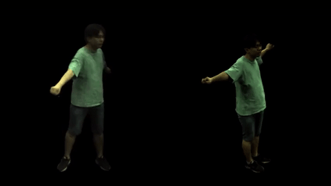

# Dual-Space NeRF
[3DV-2022] The official repo for the  paper "Dual-Space NeRF: Learning Animatable Avatars and Scene Lighting in Separate Spaces".

[[paper](https://arxiv.org/abs/2208.14851) / [video](https://youtu.be/2qk4WOO8YMw)]



## Installation

1. Clone this repository:
   ```
   git clone https://github.com/zyhbili/Dual-Space-NeRF.git
   ```

2. Install required python packages:
   ```
   pip install -r requirements.txt
   ```
3. Download the SMPL model (neutral) from:
   ```
   https://smpl.is.tue.mpg.de/
   ```
   and modify the `_C.DATASETS.SMPL_PATH` in `configs/defaults.py`. 


## Dataset

Download and unzip [ZJU_Mocap](https://github.com/zju3dv/neuralbody/blob/master/INSTALL.md#zju-mocap-dataset), then modify the `_C.DATASETS.ZJU_MOCAP_PATH` in `configs/defaults.py`. 

Prepare Human3.6M following [Animatable_NeRF](https://github.com/zju3dv/animatable_nerf) and modify the `_C.DATASETS.H36M_PATH` in `configs/defaults.py`. 


## Run the code
Take `ZJU-Mocap 313` as an example, other configs files are provided in `configs/{h36m,zju_mocap}`.
### Command Lines 
   Train Dual Space NeRF

```
python3 main.py -c configs/zju_mocap/313.yml --exp 313
```

Test Dual Space NeRF
```
python3 test.py -c configs/zju_mocap/313.yml --ckpt [ckpt_path.pth] --exp 313
```
More visualization code is coming soon...


```
@misc{zhi2022dualspace,
      title={Dual-Space NeRF: Learning Animatable Avatars and Scene Lighting in Separate Spaces}, 
      author={Yihao Zhi and Shenhan Qian and Xinhao Yan and Shenghua Gao},
      year={2022},
      eprint={2208.14851},
      archivePrefix={arXiv},
      primaryClass={cs.CV}
}
```

